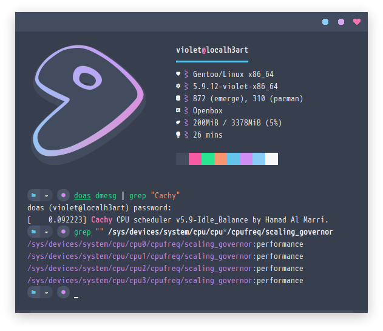
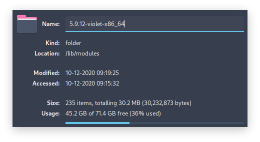

## violet-x86_64 (Gentoo)

## [usr_src_linux](./usr_src_linux)
- bzImage: LZ4
- [Xanmod based patchset](https://gitlab.com/src_prepare/src_prepare-overlay/-/tree/master/sys-kernel/xanmod-sources)
- [Cachy CPU Scheduler](https://github.com/hamadmarri/cacule-cpu-scheduler) (cachy + idle balance)
- Disable numa, debugging, etc. (kernel hacking)
- Enable Swap compressed block as default: LZ4
- AMD only (disabled most intel features)
- Governor performance
- Custom boot logo - [UwU](./usr_src_linux/drivers/video/logo/logo_linux_clut224.ppm)

## [home_username_.config](./home_username_.config)
- [Modprobed-db](https://github.com/graysky2/modprobed-db)  
*https://wiki.archlinux.org/index.php/Modprobed-db*

---
*/usr/src/linux*
```bash
make -j`nproc` menuconfig
make -j`nproc` LSMOD=/home/username/.config/modprobed.db localmodconfig
make -j`nproc` modules_install
make -j`nproc` install
```
<p align="center">
  
  
</p>
